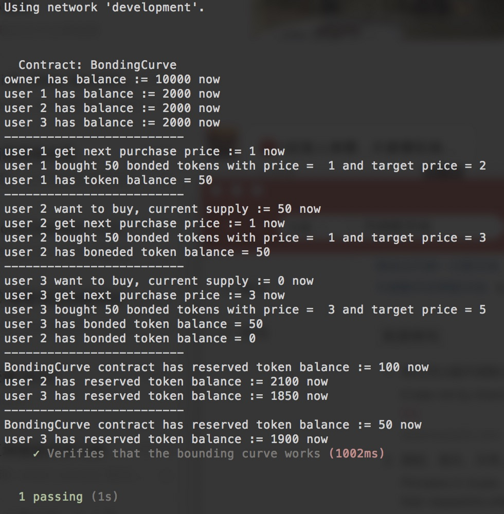

# Equilibrium Bonding Curve


```
name: solidity code of equilibrium bonding curve
type: research
status: initial draft
editor: Fang Gong <fang@oceanprotocol.com>
date: 08/23/2018
```

### Install Packages
```
npm install 
```

### Compile
``` 
truffle compile
```
### Deploy
```
truffle migrate
```

### Test
```
truffle test test/TestBonding.js
```
The output shall be similar to following:

